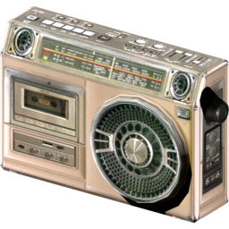
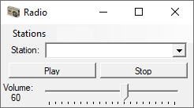

# Offline-Radio
A program to manually create and play radio stations with.

  

(The icon is a radio from Resident Evil 5)

## Current state
 currently, the program plays only premade radio stations from single audio files.

  

It currently runs as a winforms program, using [Windows media player](https://learn.microsoft.com/en-us/windows/win32/wmp/embedding-the-windows-media-player-control-in-a-c--solution) as the backend for playing audio, this is intended to be replaced by a more modern/cross-platform implementation.